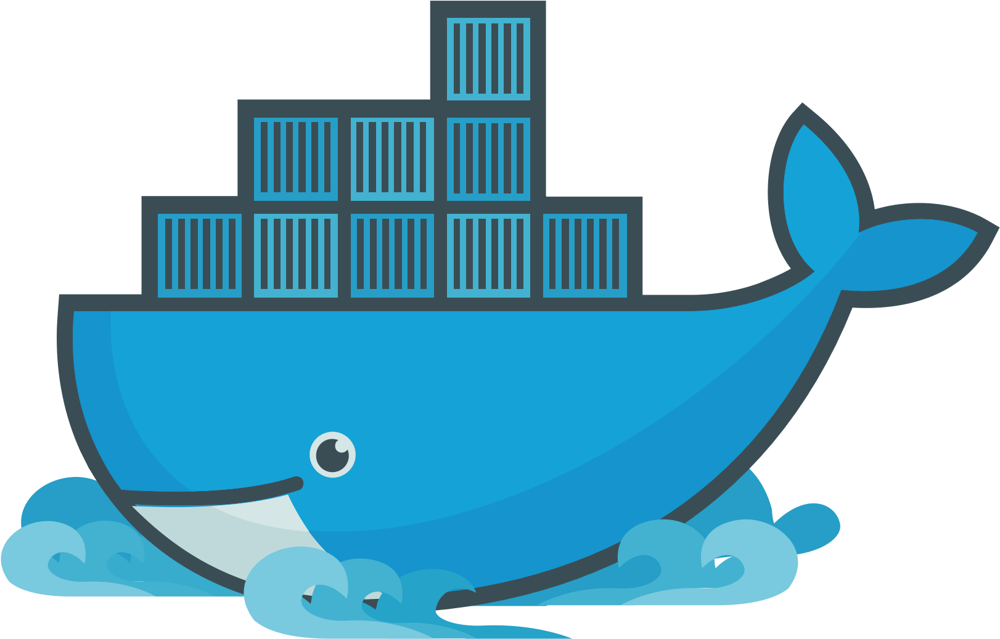
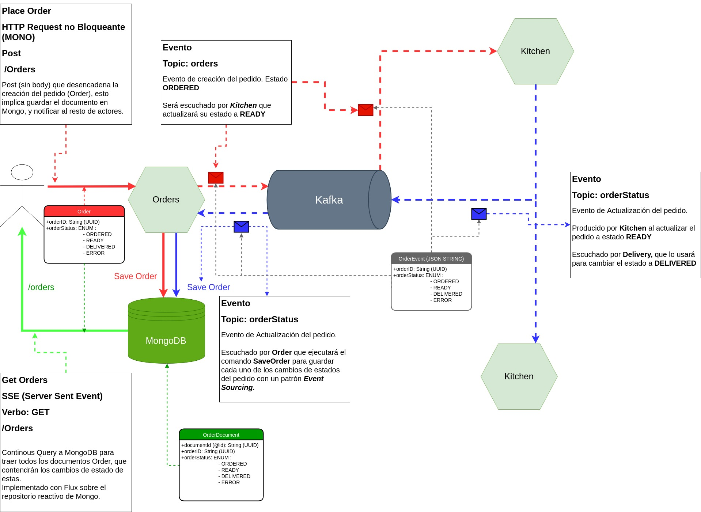
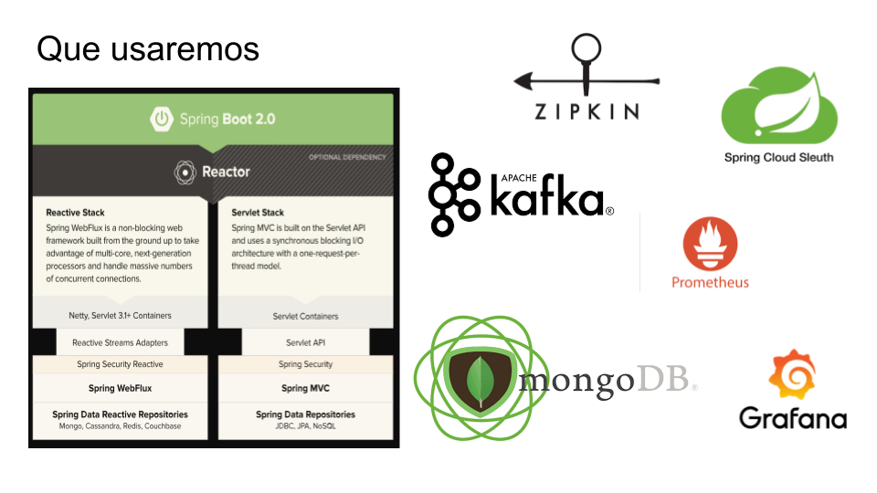
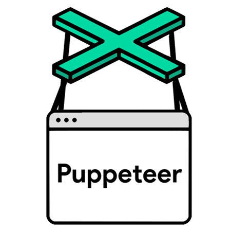

---

## hola!

---

## ¿Quiénes somos?

----

#### Oscar Gómez Soriano

-  https://github.com/ogomezso

-  https://www.linkedin.com/in/ogomezso

----

#### Jose Núñez

-  https://github.com/jocnunez

-  https://www.linkedin.com/in/josenunnez

----

- 

---

## ¿Qué vamos a hacer hoy?

----

  ¿Qué es DEVOPS?
 
---

1. Cultura DEVOPS

2. Herramientas Comunes

3. Ciclo de Vida de un Aplicación en esta cultura.

----

 DOCKER!!!

---

1. Contenedores
2. Docker 101
3. Docker Compose / Docker Swarm

---

----

# EVENT DELIVEROO

---

---

----

 
# Desarrollo Front TDD & Frameworkless!!

---

Indice

----

### Test End To End!, asegurandome que todo funciona!